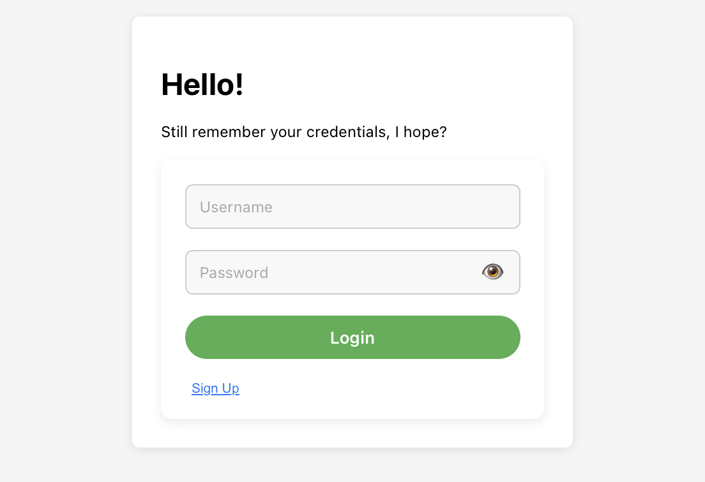
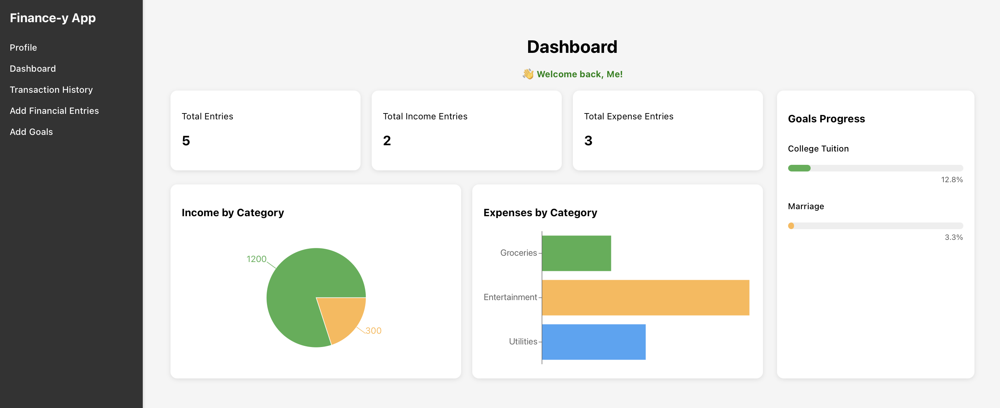
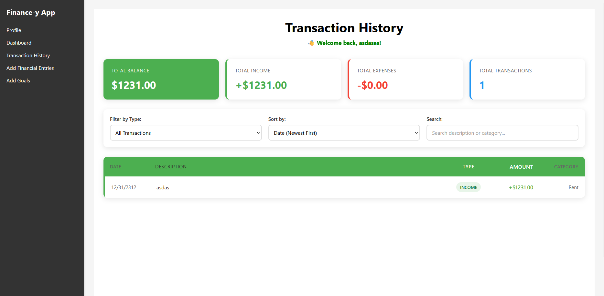
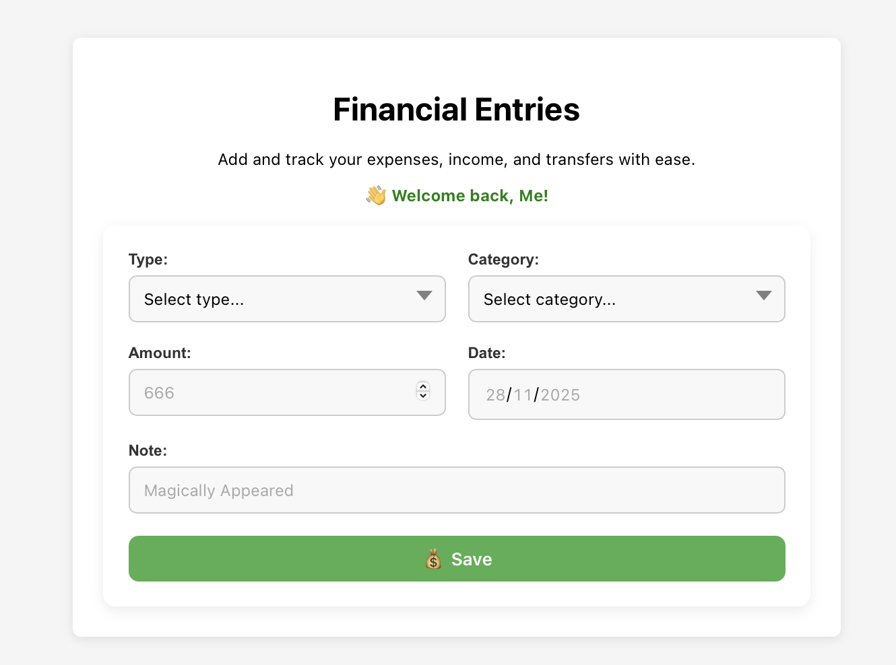
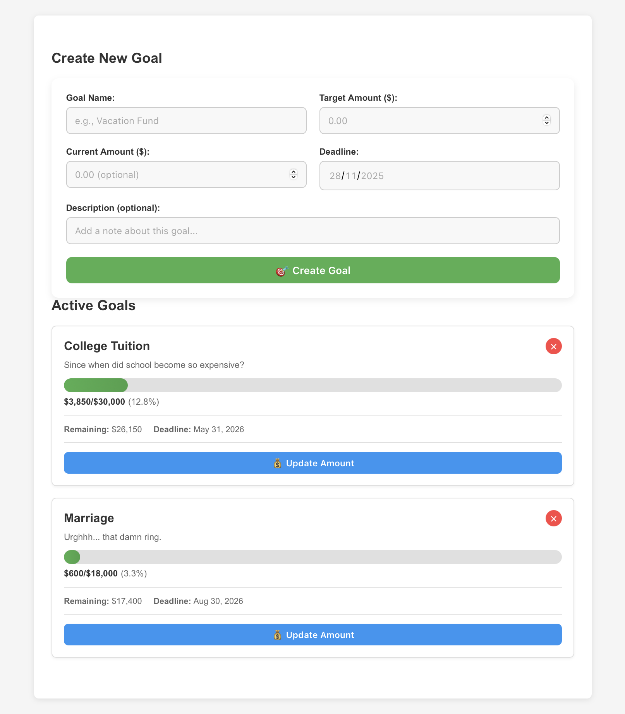

# Finance-y App

A React-based webapp for managing your personal finances. This system allows you to:

- **Add and track your transactions** – record income and expenses with notes.
- **Filter transactions** – view by date, type, or category to easily track spending habits.
- **Set financial goals** – create goals and monitor your progress toward achieving them.
- **Update or remove goals** – edit or delete goals as your priorities change.
- **Visualize your finances** – a beautiful dashboard with charts and graphs for quick insights into your income, expenses, and goal progress.

## Table of Contents

- [Features](#features)
- [Project Structure](#project-structure)
- [Installation](#installation)
- [Usage](#usage)
  - [Login / Sign Up](#login--sign-up)
  - [Dashboard](#dashboard)
  - [Transaction History](#transaction-history)
  - [Add Entry](#add-entry)
  - [Add Goal](#add-goal)
- [Scripts](#scripts)

## Features

1. **Sign Up / Login / Logout** – Users can create an account, log in to access their personal finance data, and log out securely.

2. **Persistent Data** – All transactions, goals, and settings are saved so that users don’t lose their data between sessions.

3. **User-Specific Data** – Each user has their own separate set of transactions and goals; logging in as a different user shows only their data.

4. **Add & Track Transactions** – Record income and expenses with descriptions, amounts, and optional categories.

5. **Filter Transactions** – Easily filter transactions by date, type (income/expense), or category for better financial insights.

6. **Set & Track Financial Goals** – Create goals, monitor progress, and see how close you are to achieving them.

7. **Update or Remove Goals** – Edit or delete goals to keep your financial planning up to date.

8. **Dashboard with Charts & Graphs** – Visualize income, expenses, and goal progress with a clear and interactive interface.

## Project Structure

```
.
├── package-lock.json
├── package.json
├── public
│   ├── index.html
│   └── profile_pic.jpg
├── README.md
└── src
    ├── App.css
    ├── App.js
    ├── App.test.js
    ├── components
    │   ├── AddEntryForm
    │   ├── AddGoal
    │   ├── AuthContext
    │   ├── Dashboard
    │   ├── LoginForm
    │   ├── SignupForm
    │   └── Transaction
    ├── index.css
    ├── index.js
    ├── pages
    │   ├── AddEntry
    │   ├── AddGoal
    │   ├── DashboardPage
    │   ├── Home
    │   ├── Login
    │   ├── Profile
    │   ├── Signup
    │   └── Transaction
    ├── reportWebVitals.js
    └── setupTests.js
```

## Installation

1. Clone the repository:

```bash
git clone https://github.com/FirstPotatoCoder/Finance-y-App.git
cd Finance-y-App
```

2. Install dependencies:

```bash
npm install
```

3. Run the application:

```bash
npm start
```

The application will be available at `http://localhost:3000`.

## Usage

### Login / Sign up

All data input in guest mode are **NOT** transferred when loging in. However, for data persistence, signing up and logging in are highly recommended. It takes 1 minute. Oh yeh, data is stored **PER-USER**; feel free to use **multiple accounts**!



---

### Dashboard

Displays summarized information of your Income, Expenses, and Goals.
The data might be empty at first, so try adding some data first!



---

### Transaction History

Display all your transactions! You can also filter, sort, or search! Don't forget to populate with data.



### Add Entry

This is where you add your financial entries. Fear not, your data is safe with ~~us~~ **you**. Yeh, everything is stored locally on your localStorage, so you can input **anything**.



---

### Add Goal

Add your goals here. Also, there's a neat list displayed below.



---
